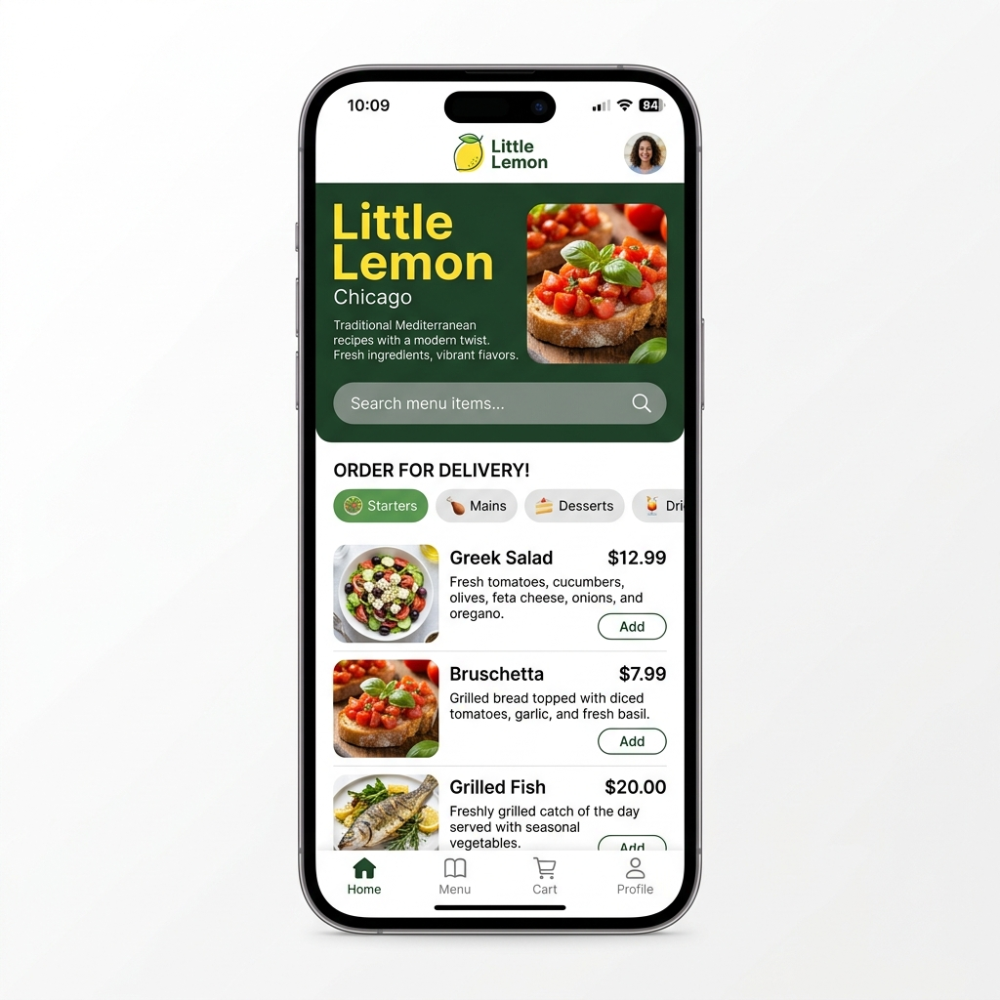

# Little Lemon Mobile Application

A cross-platform mobile application built for **Little Lemon Mediterranean Bistro** in Chicago using **React Native** and **Expo**. This capstone project implements native stack navigation, interactive onboarding, data persistence, dynamic search and category filtering, and a performant food menu layout.

---

## 📱 Home Screen Interface

Below is the layout capture of the completed Little Lemon Home Screen featuring the header avatar, hero banner, search bar, interactive category filters (`Starters`, `Mains`, `Desserts`, `Drinks`), and the vertically scrollable food menu list:



---

## 🚀 Key Features & Architecture

### 1. Native Stack Navigation Flow (`@react-navigation/native-stack`)
- **Dynamic Routing:** Automatically routes to **Onboarding** on first launch and directly to **Home** once user registration is complete.
- **System Back Navigation:** Users can smoothly navigate back from the **Profile** or secondary screens using system gestures or header back buttons.

### 2. Interactive Onboarding (`screens/OnboardingScreen.js`)
- **First-Time User Experience:** Dynamically renders on clean installs or after logging out.
- **Form Capture & Validation:** Collects **First Name**, **Last Name**, and **Email Address**.
- **Real-Time Validation:** The **Next / Register** button remains disabled (`disabledButton` style applied) until valid names and email formats are provided.

### 3. Dynamic Home Screen Layout (`screens/HomeScreen.js`)
- **Header:** Centered Little Lemon logo with a clickable user profile avatar on the top right edge (`navigation.navigate('Profile')`).
- **Hero Banner:** Features the Little Lemon title, Chicago subtitle, bistro description, and hero food photography.
- **Active Search Bar:** Real-time search (`TextInput`) filtering menu items by title or description.
- **Category Filter Targets:** Interactive category pills (`Starters`, `Mains`, `Desserts`, `Drinks`) that support toggling single or multi-category filtering.
- **Performant Food Menu (`FlatList`):** Vertically scrollable list rendering dish summaries (title, price, description, and thumbnail image) with lazy-rendering optimization and visual item separators.

### 4. Profile & Data Persistence (`screens/ProfileScreen.js`)
- **Local Persistence (`AsyncStorage`):** Retains personal registration data across app reboots (`firstName`, `lastName`, `email`, `phone`) along with notification preferences.
- **Profile Editing:** Allows users to update personal details and toggle notification subscriptions (`Order statuses`, `Password changes`, `Special offers`, `Newsletter`).
- **Purge & Log Out:** The **Log out** action button completely clears all stored registration and preference data from local device storage (`AsyncStorage.clear()`) and routes the user cleanly back to the **Onboarding** screen.

---

## 🛠️ Project Structure

```text
├── assets/
│   ├── little-lemon-logo.png
│   ├── profile.png
│   ├── icon.png
│   └── splash.png
├── navigators/
│   └── RootNavigator.js       # Stack navigator (Onboarding, Home, Profile, Welcome, Subscribe)
├── screens/
│   ├── OnboardingScreen.js    # Registration and onboarding flow
│   ├── HomeScreen.js          # Hero banner, search, filters, menu FlatList
│   ├── ProfileScreen.js       # User profile details and persistence management
│   ├── WelcomeScreen.js       # Welcome landing screen
│   └── SubscribeScreen.js     # Newsletter subscription intake window
├── utils/
│   └── index.js               # Validation utilities (validateEmail, validateName, validatePhone)
├── App.js                     # Root component with NavigationContainer
├── app.json                   # Expo application configuration
├── babel.config.js            # Babel preset configuration
├── package.json               # Dependencies and scripts
├── homescreen.png             # Capture of the completed Home Screen layout
└── README.md                  # Project documentation
```

---

## 💻 Getting Started

### Prerequisites
- [Node.js](https://nodejs.org/) (v16+)
- [Expo CLI](https://docs.expo.dev/get-started/installation/)

### Installation & Execution

1. **Install Dependencies:**
   ```bash
   npm install
   ```

2. **Start the Expo Dev Server:**
   ```bash
   npm start
   ```

3. **Run on Target Device / Emulator:**
   - Press `a` to run on Android Emulator.
   - Press `i` to run on iOS Simulator.
   - Or scan the QR code with the **Expo Go** mobile app on your physical device.

---

## 📋 Compliance & Design Standards
- **Native Styling (`StyleSheet` API):** All UI elements are styled strictly using `StyleSheet.create()` definitions. No inline styles are embedded within render loops.
- **Clean Architecture:** Modular separation between screens, navigation architecture, and utility validation scripts.
